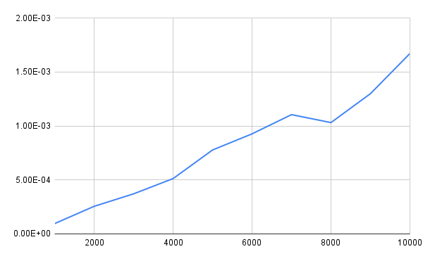

# Algorithm Analysis and Complexity Visualization

This repository contains various algorithms implemented in C++ along with their corresponding time complexity graphs.

---

## 1. Merge Sort
**Aim:** To analyze the time complexity of the Merge Sort algorithm in best, worst, and average cases and understand its efficiency.  
**Description:** Merge Sort is a divide-and-conquer algorithm that splits the array into halves, recursively sorts them, and merges them back together efficiently.  

---

## 2. Selection Sort
**Aim:** To analyze the time complexity of the Selection Sort algorithm in best, worst, and average cases and understand its efficiency.  
**Description:** Selection Sort repeatedly finds the minimum element from the unsorted part and moves it to the beginning, leading to an O(n²) time complexity.  

---

## 3. Quick Sort
**Aim:** To analyze the time complexity of the Quick Sort algorithm in best, worst, and average cases and understand its efficiency.  
**Description:** Quick Sort is an efficient divide-and-conquer sorting algorithm that selects a pivot, partitions elements, and recursively sorts subarrays.  

**Best & Average Case:**  
  

**Worst Case:**  
  

---

## 4. Bubble Sort
**Aim:** To analyze the time complexity of the Bubble Sort algorithm in best, worst, and average cases and understand its efficiency.  
**Description:** Bubble Sort repeatedly swaps adjacent elements if they are in the wrong order, leading to an O(n²) time complexity in the worst case.  

**Average & Worst Case:**  
.png)  

**Best Case:**  
.png)  

---

## 5. 1D Peak Finding
**Aim:** To implement and analyze algorithms that find a peak element in a one-dimensional array.  
**Description:** A peak element is an element greater than or equal to its neighbors. The algorithm finds a peak efficiently in O(log n) time.  

---

## 6. 2D Peak Finding
**Aim:** To implement and analyze algorithms that find a peak element in a two-dimensional array.  
**Description:** This algorithm extends 1D peak finding to 2D matrices, finding an element that is greater than or equal to its adjacent elements.  

---

## 7. Binary Search
**Aim:** To implement Binary Search and analyze its efficiency in searching sorted data.  
**Description:** Binary Search is a logarithmic search algorithm that repeatedly divides the search space in half, achieving O(log n) time complexity.  

---

## 8. Iterative Quick Sort
**Aim:** To implement Quick Sort using an iterative approach and compare it with the recursive version.  
**Description:** The iterative version of Quick Sort uses an explicit stack instead of recursion, maintaining efficiency while avoiding deep recursion overhead.  

---

## 9. Tower of Hanoi
**Aim:** To solve the Tower of Hanoi problem using recursion and analyze its time complexity.  
**Description:** A recursive problem where disks must be moved between rods under specific constraints, with an exponential time complexity of O(2ⁿ).  

---

## 10. Stack Calls in Quick Sort
**Aim:** To understand and visualize the recursive stack behavior of Quick Sort.  
**Description:** This visualizes the recursive function calls in Quick Sort to understand the depth of recursion and stack usage.  

---

## 11. Magic Square
**Aim:** To generate a magic square.  
**Description:** A magic square is a grid of distinct numbers where row, column, and diagonal sums are equal.  

---

## 12. Matrix Multiplication - Brute Force
**Aim:** To implement matrix multiplication using the brute force approach.  
**Description:** Standard O(n³) matrix multiplication using three nested loops.  

---

## 13. Matrix Multiplication - Divide and Conquer
**Aim:** To implement matrix multiplication using the divide and conquer approach.  
**Description:** This method recursively breaks matrices into smaller blocks for multiplication.  

---

## 14. Matrix Multiplication - Strassen's Algorithm
**Aim:** To implement matrix multiplication using Strassen’s approach.  
**Description:** Strassen’s method reduces the number of multiplications to improve efficiency.  

---

## 15. Knapsack Problem
**Aim:** To solve the Knapsack problem using the greedy method.  
**Description:** The greedy approach optimally selects items based on value-to-weight ratio in the fractional knapsack problem.  

---

## 16. Activity Selection
**Aim:** To implement the Activity Selection problem using greedy algorithms for optimal task scheduling.  
**Description:** The algorithm schedules non-overlapping activities by selecting tasks that finish earliest.  

---

## 17. Dijkstra’s Algorithm
**Aim:** To apply Dijkstra’s algorithm for finding the shortest path from a single source in a weighted graph.  
**Description:** Dijkstra’s algorithm efficiently finds the shortest path using a priority queue, with O((V+E) log V) complexity.  

---

## 18. Prim’s Algorithm
**Aim:** To implement Prim’s algorithm for constructing the Minimum Spanning Tree of a graph.  
**Description:** Prim’s algorithm greedily grows the MST by selecting the smallest edge at each step.  

---

## 19. Kruskal’s Algorithm
**Aim:** To implement Kruskal’s algorithm for constructing the Minimum Spanning Tree of a graph.  
**Description:** Kruskal’s algorithm sorts edges and greedily adds them while avoiding cycles, using the Disjoint Set Union (DSU) structure.  

---

## 20. All Pairs Shortest Path (Floyd-Warshall)
**Aim:** To determine the shortest paths between all pairs of vertices in a graph.  
**Description:** Floyd-Warshall is a dynamic programming-based approach with O(V³) complexity for computing shortest paths.  

---

## 21. Multi-Stage Graph Problem
**Aim:** To implement the shortest path algorithm for solving multi-stage graph problems.  
**Description:** This approach finds the shortest path in a weighted, directed multi-stage graph using dynamic programming.  

---

## 22. Stage Count in Multi-Stage Graph
**Aim:** To analyze and determine the number of stages in a multi-stage graph.  
**Description:** This algorithm determines the number of stages and optimizes path traversal.  

(No graph available)

---
